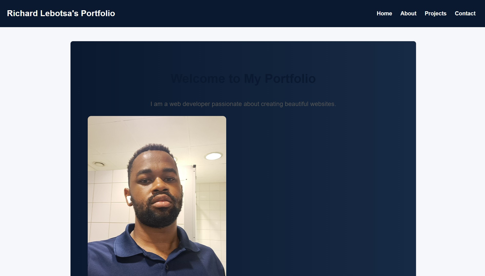
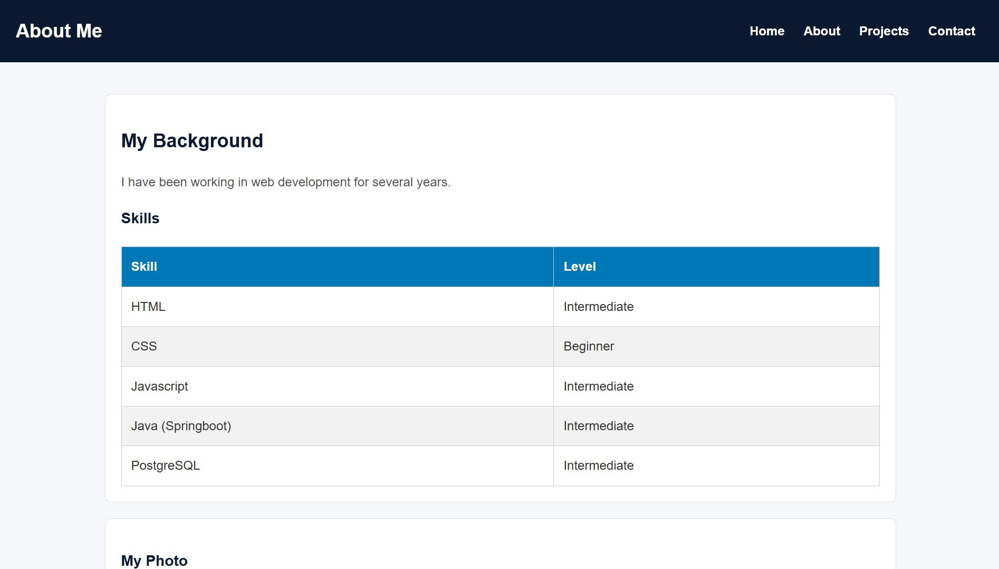
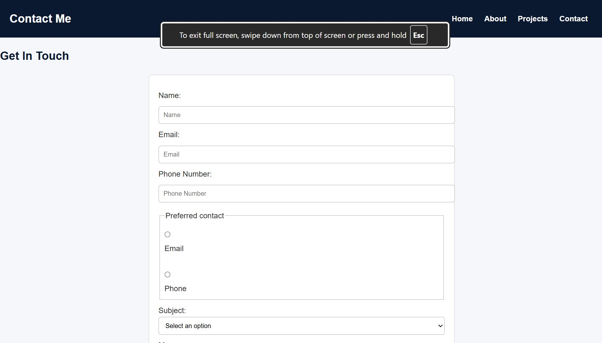
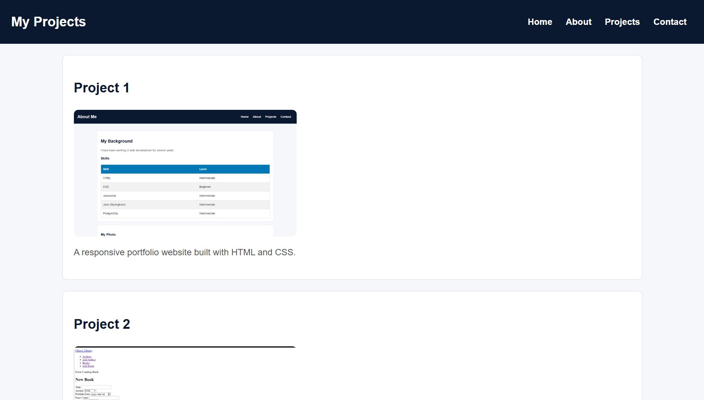
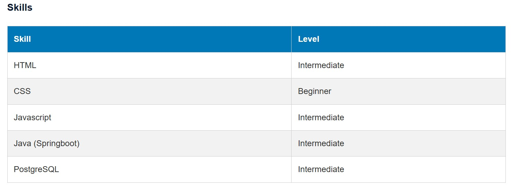
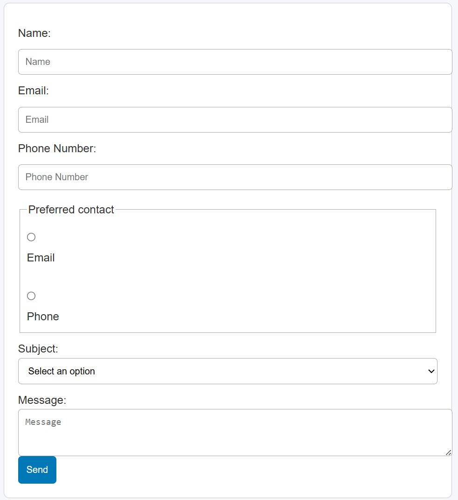
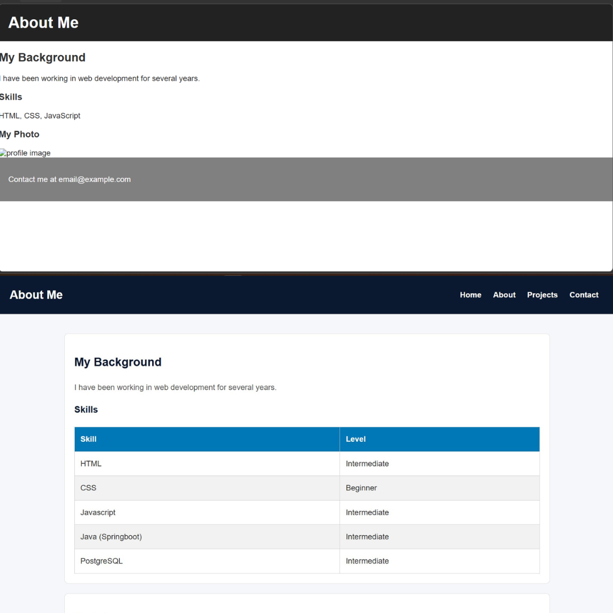

# Portfolio Website

## Overview

This is a personal portfolio website created as part of an assignment. The purpose of the website is to showcase my skills, basic web development knowledge, and ability to work with HTML and CSS. The website includes four pages with a navigation menu, a form, and a table to demonstrate different elements and layouts.

## Issues Found

While working with the starter code, I identified several problems:

- Missing semantic HTML elements (e.g no proper use of `<header>`, `<section>`, etc)
- Poor structure and inconsistent indentation
- Some elements were not responsive
- Form inputs were not properly labeled
- Navigation links were not styled clearly since there was no navigation to begin with
- Table had no proper styling since it was also not present as well
- CSS had missing minimum type of selectors required

## Fixes Implemented

To improve the code, I made the following changes:

- Reorganized the HTML structure using semantic elements
- Fixed indentation and formatting for readability
- Added proper labels and attributes to form inputs
- Styled the navigation menu and added hover effects
- Improved the table layout with borders and spacing
- Corrected, simplified CSS styling and added more styling
- Made basic adjustments for responsiveness

## HTML Structure

The final HTML structure uses semantic elements such as `<header>`, `<nav>`, `<main>`, `<section>`, and `<footer>`. This makes the code easier to understand and improves accessibility. Each page follows a similar layout for consistency, with a clear separation between content sections.

## CSS Styling Approach

The CSS focuses on simplicity and readability. I used:

- Element selectors for general styling (e.g. body, h1)
- Class selectors for reusable components
- Used pseudo-class selectors for hover effects
- Minimal use of IDs
- I used flexbox for layout in some sections, especially for alignment and spacing.
- Hover effects were added to navigation links to improve user interaction.

## Accessibility Improvements

- Added labels to all form inputs
- Used semantic HTML elements, replacing div tags
- Ensured text is readable with proper contrast
- Added/Updated alt text to all images
- Structured content in a logical order
- Used flexbox to style navigation to ensure its easily accessible
- Ensured that the form is styled so that it is easy to use

## How to View the Website

### Method 1

1. Download zip file, then unzip or clone the project files
2. Open the project folder
3. Open the index.html file in a web browser
4. Use the navigation menu to access other pages

### Method 2

1. Download file, then unzip or clone the project files
2. Open the project folder using vs code
3. Install the live server extension if you do not have it
4. Right click any of the four html files, say the index.html and select open with live server
5. Or click 'Go live' on the bottom right corner of vs code, file will automatically load on the browser
6. Use the navigation menu to access other pages
7. Once done viewing, close the server by clicking on the bottom right corner of vs code

## Screenshots

### Home Page

### About Page

### Contact Page

### Projects Page

### Styled Table

### Styled Form

### Styled Navigation

### Before and after image of About Me Page

## Reflection

The html part was not a problem to debug, had to fix the errors first then after add what was missing and use semantic tags to replace the div tags to help with accessbility and meaning and better SEO ranking of the website.  Used W3C validator to help with checking final work if there are any errors.
One of the main challenges was understanding and fixing the issues in the starter code. Some errors were not obvious, especially in the CSS. I solved this by testing changes step by step and using the browser’s developer tools to debug layout and styling problems. Used W3C validator as well to check for any code formattig errors and any other errors as well. This project helped me better understand how HTML and CSS work together and how to structure a simple website properly.
